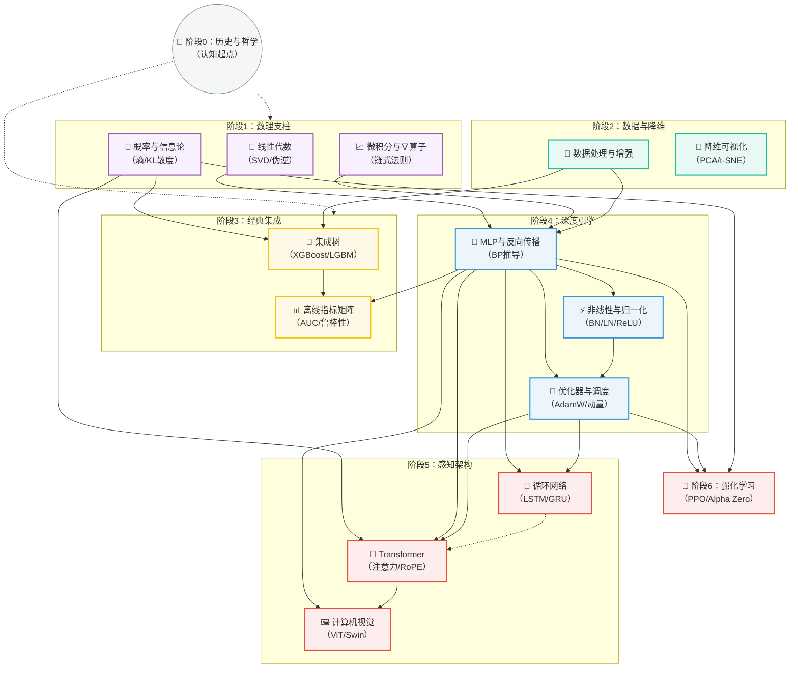

# Machine Learning 笔记

大部分AI生成

## 学习过程
#

#

## 常用网站

### 实践练习
#

- kaggle

- 晨涧云 租用cuda

- huggingface  (for dataset, model)  
- bohrium (慎用)

- minimind github
### 技术文档

- pytorch

- sklearn

- [https://transformers.run/](https://transformers.run/)