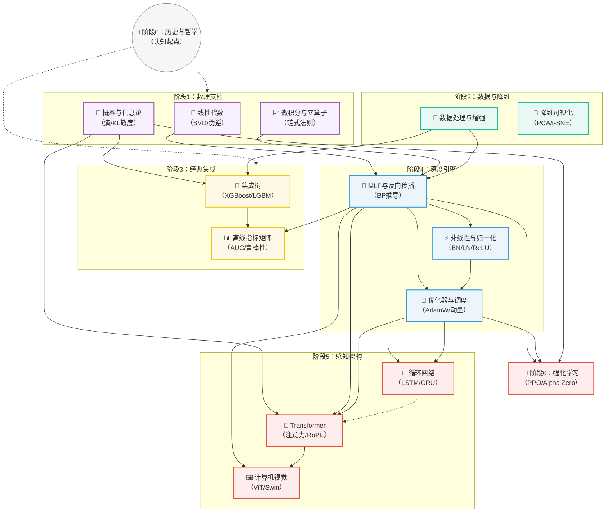

# Machine Learning 讲义

> **教学风格承诺**：直观理解（生活隐喻）→ 严谨定义（数学语言）→ 工程实践（落地准则）。
> **适用人群**：准大学生（零基础友好）及大学生系统性复习。
> **核心策略**：摒弃平铺直叙，采用“螺旋上升”架构。先建世界观，再夯数理地基，后攻深度学习与现代多模态。

---

## 第一部分：课程哲学与全景图

机器学习不是算法的堆砌，而是**“数据驱动下的函数逼近论”**。本课程将沿着 **“哲学认知 → 数理工具 → 数据工程 → 经典范式 → 深度引擎 → 感知架构 → 通用智能”** 的路径，带你从底层逻辑直达顶会论文的入口。

---

## 第二部分：七阶段课程结构（严格渐进）

### 🪐 阶段 0：开宗明义 —— 机器学习的“世界观”
> **依赖**：无。这是给大脑“格式化”的第一课。
> **包含原文件**：`1.0 History & Philosophy.md`

- **核心任务**：搞懂什么是“学习”。区分符号主义与连接主义，理解为什么 2012 年的 AlexNet 是分水岭。
- **哲学议题**：经验主义 vs. 先天论；归纳偏置；黑箱困境的伦理审视。
- **目标**：在推导任何公式之前，先建立对“泛化”与“过拟合”的本能直觉。

---

### 🧮 阶段 1：三大数理支柱 —— 不可逾越的底层代码
> **依赖**：阶段 0（了解“为何而学”后，才有动力啃公式）。
> **包含原文件**：`1.1线性代数基础.md`， `1.2导数.md`， `1.3概率论与信息论.md`

**教学策略**：不教纯数学，只教“ML 用得上的数学”。

1. **线性代数（空间与变换）**：从向量空间、四大基本子空间出发，直击 **SVD（奇异值分解）** 与伪逆。重点理解“矩阵即映射”。
2. **微积分与 ∇ 算子（变化与优化）**：严格定义梯度、雅可比、海森矩阵。核心推导 **Softmax + 交叉熵** 的联合导数，并解释为何深度学习不用二阶 Hessian（牛顿法）——因为参数空间太大，矩阵求逆不现实。
3. **概率论与信息论（不确定性）**：概率公理、贝叶斯定理、期望与方差。信息论部分紧抓 **熵、交叉熵、KL 散度**，为后续决策树分叉和变分推断埋下伏笔。

---

### 🧹 阶段 2：数据工程与降维预览 —— 喂给模型的“食材”
> **依赖**：阶段 1（需具备基本的矩阵运算和统计概念）。
> **包含原文件**：`8.Data Processing.md`， `9.降维.md`

1. **数据清洗与特征工程**：缺失值插补、异常值检测（3σ 原则）、归一化（Standardization vs. Normalization）、类别编码（One-hot / Label Encoding）。
2. **高维诅咒与降维**：先讲 PCA（线性，基于协方差矩阵特征分解），再讲 t-SNE / UMAP（非线性，基于邻域概率）。**关键洞察**：降维不仅是可视化工具，更是对数据流形假设的验证。

---

### 🌲 阶段 3：经典机器学习 —— 结构化数据的统治力量
> **依赖**：阶段 2（数据洗好才能喂树），阶段 1（概率论用于理解信息增益）。
> **包含原文件**：`3.决策树.md`， `2.Metrics.md`

1. **集成树三剑客（必杀技）**：
   - **随机森林**：Bagging + 特征随机，如何降低方差。
   - **XGBoost**：Boosting + 二阶泰勒展开 + 正则化，如何精准拟合残差。
   - **LightGBM / CatBoost**：直方图加速、Leaf-wise 生长、有序目标编码（解决预测偏移）。
2. **模型验收体系（离线指标）**：超越简单的准确率，深入 **混淆矩阵衍生指标（Precision/Recall/F1）**、**AUC-ROC / PR 曲线**（应对正负例不平衡）、回归任务的 MAE/RMSE。同时引入鲁棒性（对抗攻击）和公平性（群体公平指标）的验收理念。

---

### ⚙️ 阶段 4：深度学习核心引擎 —— 梯度流与参数进化
> **依赖**：**强硬依赖** 阶段 1（尤其是 ∇ 算子和链式法则）。建议先修阶段 3（体会手工特征工程的繁琐，才懂得自动特征提取的可贵）。
> **包含原文件**：`4.0 MLP.md`， `4.1 非线性层.md`， `4.2 Optimizer.md`

**这是全课程的“心脏”**。

1. **MLP（多层感知机）与反向传播（BP）**：严格推导 **误差项 δ（Delta）** 的递推公式。解释为什么 BP 是“动态规划”在计算图上的胜利。
2. **激活函数与归一化（破壁与稳定）**：
   - 激活函数：从 Sigmoid 的梯度消失讲到 ReLU（稀疏性），再到 GELU / Swish（Smooth 近似）。
   - 归一化：用统一视角（超参数 $G$ 组数）彻底讲透 **Batch Norm（CV 常用）** vs. **Layer Norm / RMSNorm（NLP/Transformer 标配）** vs. **Group Norm（小批量救星）**。
3. **优化器与学习率调度**：
   - 从 BGD / SGD / Mini-batch 讲起，引入动量（Polyak）和 Nesterov。
   - 自适应家族：AdaGrad（稀疏特征）→ RMSProp（指数衰减）→ **Adam / AdamW（解耦权重衰减，大模型标配）**。
   - 补充：梯度裁剪（Gradient Clipping）防止梯度爆炸；Warm-up 策略的原理。

---

### 🚀 阶段 5：序列与空间 —— 现代感知架构的崛起
> **依赖**：阶段 4（必须扎实掌握 Attention 所需的矩阵乘法和梯度流）。
> **包含原文件**：`6.RNN.md`， `5.Transformer Basis.md`， `7.Vision.md`

**本阶段分为三个平行宇宙（按兴趣选修，但 Transformer 强烈建议必修）**：

1. **循环时序（RNN / LSTM / GRU）**：理解 BPTT（随时间反向传播），LSTM 的“门控机制”如何构建梯度高速公路（细胞状态 $C_t$ 的加法更新）。CNN + RNN 的 CRNN 架构（含 CTC 损失对齐）。
2. **Transformer 基石（划时代的注意力）**：严格定义 **缩放点积注意力（Scaled Dot-Product）** → **多头注意力（MHA）**。吃透位置编码（绝对正弦 vs. RoPE 旋转位置编码 vs. ALiBi）。理解 Encoder-Decoder 架构中的掩码（Masking）机制与因果推断。
3. **计算机视觉演进**：从 CNN（局部连接/权值共享）到 **ResNet（残差连接解决退化问题）**，再到 **ViT（将图像打成 Patch 输入 Transformer）** 和 **Swin Transformer（窗口注意力 + 移位，构建层次化金字塔）**。

---

### 🧠 阶段 6：通用智能体的终极挑战 —— 强化学习
> **依赖**：阶段 4（深度网络作为函数近似器）和阶段 1（马尔可夫链/概率图模型基础）。
> **包含原文件**：`10.强化学习.md`

1. **数学建模**：MDP（马尔可夫决策过程）五元组、回报（Return）、贝尔曼期望/最优方程。
2. **深度强化学习流派**：
   - **DQN（值函数派）**：经验回放（Experience Replay）和目标网络（Target Network）打破数据相关性。
   - **PPO（策略梯度派，当前工业界标准）**：理解 Importance Sampling 和 Clip 裁剪如何保证“信任区域”的单调提升。
   - **Alpha Zero（规划派顶峰）**：MCTS（蒙特卡洛树搜索） + 策略-价值网络（Policy-Value Net）的自对弈（Self-Play）强化循环。

---

## 第三部分：完整依赖树（Mermaid）

> 请使用支持 Mermaid 的 Markdown 渲染器查看下图。**实线箭头** = 强前置必修；**虚线箭头** = 推荐并行参考。

---

## 第四部分：给准大学生的“避坑”阅读建议

为了防止你在海量公式中迷失，请遵循以下 **“红绿灯”阅读规则**：

1. **绿色通道（必读且必须手推）**：
   - 线性代数的 **SVD 几何含义**。
   - 微积分中的 **链式法则与 Softmax 求导**。
   - 概率论的 **贝叶斯定理与 KL 散度**。
   - 深度学习的 **反向传播（BP）三行核心推导** 与 **Transformer 的 Attention 矩阵乘法维度变换**。

2. **黄色通道（理解思想，不必死磕中间推导）**：
   - 集成树中的 **二阶泰勒展开（XGBoost）**——知道是为了更快收敛即可。
   - 优化器中的 **海森矩阵（牛顿法）**——知道为什么深度学习抛弃它（O(n³) 复杂度）即可。

3. **红色通道（第一遍阅读可跳过，第二遍进阶再看）**：
   - UMAP 的 **拓扑流形（模糊单纯集）** 严格数学定义。
   - Alpha Zero 的 **MCTS 异步搜索** 的工程细节。

---

## 结语：学习的“残差连接”

最后，请记住这张课程图谱的本质：**阶段 0 是你理解的“恒等映射”，阶段 1 是“特征提取”，阶段 2-6 是“深层网络”。** 如果在后续学习中遇到阻塞，请随时回到前置依赖章节补充“梯度”——这正是本结构化课程存在的终极意义。祝你学有所成，洞悉智能的本质。
