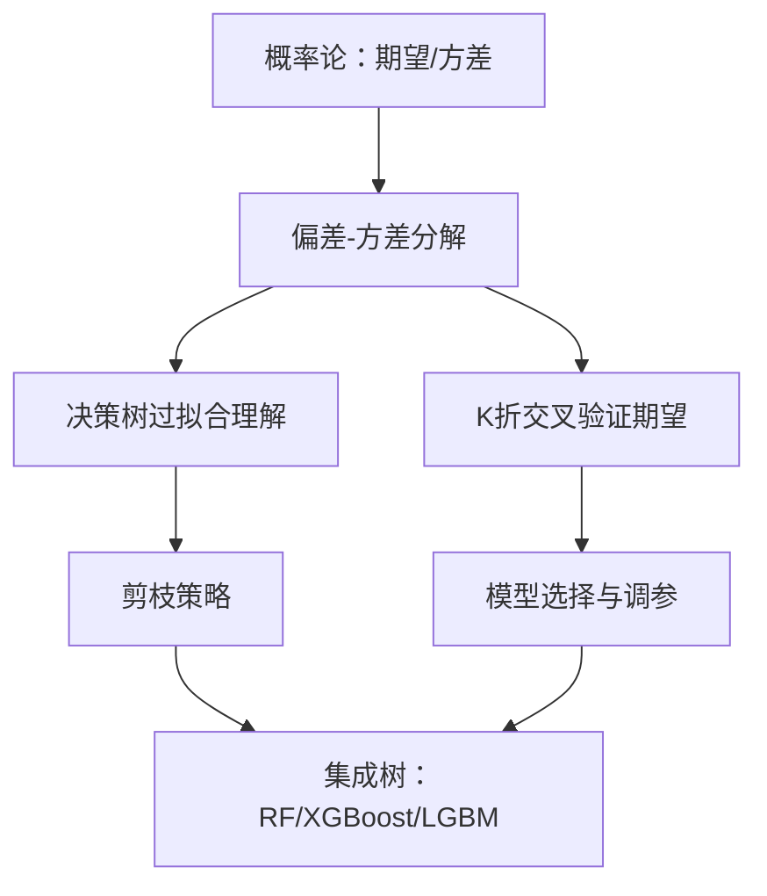

# 误差、偏差-方差分解、K 折交叉验证期望与决策树进阶


---

## 第一部分：误差从何而来？—— 偏差-方差分解

### 1.1 直观理解：打靶的隐喻

想象你在打靶：

- **偏差（Bias）**：你瞄准的**中心点**离靶心有多远。高偏差 = 系统性偏移，模型太简单（欠拟合）。
- **方差（Variance）**：你每次射击的**散布范围**有多大。高方差 = 对训练数据过度敏感，模型太复杂（过拟合）。
- **不可约误差（Irreducible Error）**：靶子本身在晃动，子弹有制造公差。这是数据中固有的噪声，任何模型都无法消除。

**核心矛盾**：偏差和方差通常此消彼长（Bias-Variance Tradeoff）。模型复杂度增加 → 偏差下降，方差上升；反之亦然。

### 1.2 严谨定义：期望泛化误差的分解

设真实数据生成过程为：

$$
y = f(x) + \epsilon,\quad \mathbb{E}[\epsilon] = 0,\quad \text{Var}(\epsilon) = \sigma^2
$$

我们训练得到的模型为 $\hat{f}(x)$（注意：$\hat{f}$ 是**随训练集 D 变化的随机变量**）。

**定义**：在固定测试点 $x$ 处，模型 $\hat{f}$ 的期望泛化误差为：

$$
\text{Err}(x) = \mathbb{E}_{D,\epsilon}\left[ (y - \hat{f}_D(x))^2 \right]
$$

**定理（偏差-方差分解）**：

$$
\text{Err}(x) = \underbrace{\left( \mathbb{E}_D[\hat{f}_D(x)] - f(x) \right)^2}_{\text{Bias}^2} + \underbrace{\mathbb{E}_D\left[ \left( \hat{f}_D(x) - \mathbb{E}_D[\hat{f}_D(x)] \right)^2 \right]}_{\text{Variance}} + \underbrace{\sigma^2}_{\text{Noise}}
$$

### 1.3 严格推导

记 $\bar{f}(x) = \mathbb{E}_D[\hat{f}_D(x)]$，为简化记号省略 $x$ 和下标 $D$。

**第一步**：拆开平方项。注意 $y = f + \epsilon$，且 $\epsilon$ 与 $\hat{f}$ 独立（$\epsilon$ 是测试时的噪声，与训练集无关）。

$$
\mathbb{E}[(y - \hat{f})^2] = \mathbb{E}[(f + \epsilon - \hat{f})^2]
$$

**第二步**：加减 $\bar{f}$，凑出三项。

$$
= \mathbb{E}[(f - \bar{f} + \bar{f} - \hat{f} + \epsilon)^2]
$$

**第三步**：展开。

$$
= \mathbb{E}[(f - \bar{f})^2] + \mathbb{E}[(\bar{f} - \hat{f})^2] + \mathbb{E}[\epsilon^2] + 2\underbrace{\mathbb{E}[(f - \bar{f})(\bar{f} - \hat{f})]}_{=0} + 2\underbrace{\mathbb{E}[(f - \bar{f})\epsilon]}_{=0} + 2\underbrace{\mathbb{E}[(\bar{f} - \hat{f})\epsilon]}_{=0}
$$

**为什么交叉项为零？**

- $\mathbb{E}[(f - \bar{f})(\bar{f} - \hat{f})]$：$f - \bar{f}$ 是常数（对 D 求期望后无随机性），$\mathbb{E}[\bar{f} - \hat{f}] = \bar{f} - \bar{f} = 0$，故为零。
- $\mathbb{E}[(f - \bar{f})\epsilon]$：$\epsilon$ 与训练集独立且 $\mathbb{E}[\epsilon]=0$，故为零。
- $\mathbb{E}[(\bar{f} - \hat{f})\epsilon]$：同理为零。

**第四步**：得到最终分解。

$$
\boxed{\text{Err}(x) = \underbrace{(f - \bar{f})^2}_{\text{Bias}^2} + \underbrace{\mathbb{E}[(\hat{f} - \bar{f})^2]}_{\text{Variance}} + \underbrace{\sigma^2}_{\text{Noise}}}
$$

### 1.4 工程启示

| 现象   | 偏差 | 方差 | 解决方向                            |
| ------ | ---- | ---- | ----------------------------------- |
| 欠拟合 | 高   | 低   | 增加模型复杂度、加特征、减正则      |
| 过拟合 | 低   | 高   | 加数据、加正则、Dropout、早停、集成 |
| 理想   | 低   | 低   | 需要更多数据或更强先验              |

**关键洞察**：  
- 增加训练数据 → 降低方差，但不改变偏差。  
- 增加模型复杂度 → 降低偏差，但提高方差。  
- 集成方法（Bagging）→ 主要降方差；Boosting → 主要降偏差。

---

## 第二部分：K 折交叉验证期望的推导

### 2.1 为什么要做 K 折？

我们真正关心的是**期望泛化误差** $\mathbb{E}_D[\text{Err}]$，但手头只有一个数据集 $S$。  
留出法（Hold-out）只用部分数据训练，浪费信息且评估不稳定。  
**K 折交叉验证（K-Fold CV）** 把数据分成 K 份，轮流用 K-1 份训练、1 份验证，最终取平均。

### 2.2 严格定义

设数据集 $S = \{z_1, z_2, \dots, z_N\}$，随机划分为 K 个大小近似相等的折 $S_1, \dots, S_K$。  
对第 $k$ 折，用 $S \setminus S_k$ 训练模型 $\hat{f}_{-k}$，在 $S_k$ 上评估损失：

$$
\text{CV}_K = \frac{1}{K} \sum_{k=1}^K \frac{1}{|S_k|} \sum_{z_i \in S_k} L(z_i, \hat{f}_{-k})
$$

### 2.3 期望推导：CV 是无偏的吗？

**问题**：$\mathbb{E}[\text{CV}_K]$ 是否等于 $\mathbb{E}_D[\text{Err}]$？

**设定**：假设数据 $z_i$ 独立同分布（i.i.d.）来自分布 $\mathcal{D}$，损失函数为 $L$。

**第一步**：对划分取期望。

$$
\mathbb{E}_{S, \text{split}}[\text{CV}_K] = \frac{1}{K} \sum_{k=1}^K \mathbb{E}\left[ \frac{1}{|S_k|} \sum_{z_i \in S_k} L(z_i, \hat{f}_{-k}) \right]
$$

**第二步**：由对称性，每一折的期望相同。

$$
= \mathbb{E}\left[ \frac{1}{|S_1|} \sum_{z_i \in S_1} L(z_i, \hat{f}_{-1}) \right]
$$

**第三步**：设 $n = N/K$ 为每折样本数。固定 $S_1 = \{z_1, \dots, z_n\}$。

$$
= \frac{1}{n} \sum_{i=1}^n \mathbb{E}\left[ L(z_i, \hat{f}_{-1}) \right]
$$

**第四步**：每个 $z_i$ 与训练集 $S \setminus S_1$ 独立（因为划分是随机的），因此：

$$
\mathbb{E}\left[ L(z_i, \hat{f}_{-1}) \right] = \mathbb{E}_{D \sim \mathcal{D}^{N-n}}\left[ \mathbb{E}_{z \sim \mathcal{D}}\left[ L(z, \hat{f}_D) \right] \right]
$$

这正是**用 $N-n = N(K-1)/K$ 个样本训练时的期望泛化误差**。

**结论**：

$$
\boxed{\mathbb{E}[\text{CV}_K] = \mathbb{E}_{D \sim \mathcal{D}^{N(K-1)/K}}\left[ \text{Err}(\hat{f}_D) \right]}
$$

**关键洞察**：

1. **CV 估计的不是 $N$ 个样本训练的模型的误差**，而是 **$N(K-1)/K$ 个样本训练的模型的误差**。  
   - K 越大，训练集越接近 $N$，偏差越小（但计算越贵）。  
   - K 越小，训练集越小，CV 会**高估**泛化误差（悲观偏差）。

2. **CV 的方差**：各折的训练集高度重叠，评估结果**不独立**，因此 CV 的方差不能简单按 $1/K$ 计算。  
   - 这导致 CV 的方差估计可能偏大或偏小，取决于模型稳定性。
   - 重复 K 折（Repeated K-Fold）可降低划分带来的随机性。

3. **特例**：留一法（LOO，K=N）  
   - 训练集大小为 $N-1$，几乎无偏。  
   - 但方差极大（各折模型几乎相同，相关性接近 1），且计算代价 $O(N)$ 次训练。  
   - 对不稳定模型（如 KNN），LOO 方差可能爆炸。

### 2.4 工程实践准则

| K 值        | 偏差 | 方差 | 计算量 | 适用场景               |
| ----------- | ---- | ---- | ------ | ---------------------- |
| K=5         | 中等 | 中等 | 5 次   | 默认选择，快速评估     |
| K=10        | 小   | 中等 | 10 次  | 标准选择，论文常用     |
| K=N (LOO)   | 最小 | 最大 | N 次   | 极小数据集，但慎用     |
| 分层 K 折   | 同上 | 更低 | 同上   | 类别不平衡分类任务     |
| 时间序列 CV | 无偏 | —    | —      | 时序数据，不能随机划分 |

**分层 K 折（Stratified K-Fold）**：每折中类别比例与原始数据一致，显著降低评估方差，是分类任务的默认选择。

---

## 第三部分：决策树进阶

### 3.1 决策树的核心：递归划分与纯度度量

决策树的本质是**在特征空间中递归地做轴对齐划分**，每次划分选择让子节点“纯度”最高的特征和阈值。

三种经典纯度度量：

| 指标               | 公式                      | 特点                     |
| ------------------ | ------------------------- | ------------------------ |
| 信息增益（ID3）    | $IG = H(D) - \sum \frac{ | D_v                      | }{ | D | } H(D_v)$ | 偏向取值多的特征 |
| 信息增益率（C4.5） | $IGR = IG / H_A(D)$     | 惩罚特征取值数           |
| 基尼指数（CART）   | $Gini = 1 - \sum p_k^2$ | 计算快，无对数，默认选择 |

**基尼指数 vs 熵**：  
- 基尼指数是熵的一阶近似，计算更快（无 log）。  
- 实际效果差异很小，CART 用基尼，C4.5 用熵。

### 3.2 连续特征与缺失值处理

**连续特征划分**：  
- 对特征排序，取相邻值中点作为候选阈值。  
- 选择使加权纯度最高的阈值。  
- 复杂度 $O(N \log N)$ 每次划分。

**缺失值处理（C4.5 策略）**：  
- 训练时：样本按权重分配到所有子节点，权重与子节点样本比例成正比。  
- 预测时：若特征缺失，走样本数最多的分支，或按权重加权所有分支的结果。

### 3.3 剪枝：对抗过拟合的核心武器

**预剪枝（Pre-pruning）**：  
- 限制最大深度 `max_depth`。  
- 限制叶子最小样本数 `min_samples_leaf`。  
- 限制分裂最小样本数 `min_samples_split`。  
- 限制信息增益阈值 `min_impurity_decrease`。  
- 优点：快，防止过拟合。  
- 缺点：可能欠拟合（贪心停止过早）。

**后剪枝（Post-pruning）**：  
- 先让树长到最大，再自底向上剪枝。  
- **代价复杂度剪枝（CCP）**：

$$
R_\alpha(T) = R(T) + \alpha |T|
$$

其中 $R(T)$ 是训练误差，$|T|$ 是叶子数，$\alpha$ 是惩罚系数。  
- 对每个 $\alpha$，存在唯一最优子树。  
- 通过交叉验证选择最优 $\alpha$。  
- 优点：效果通常优于预剪枝。  
- 缺点：计算量大。

**sklearn 工程模板**：

```python
from sklearn.tree import DecisionTreeClassifier
from sklearn.model_selection import GridSearchCV

tree = DecisionTreeClassifier(
    criterion='gini',
    max_depth=None,
    min_samples_leaf=5,
    ccp_alpha=0.01,  # 后剪枝
    class_weight='balanced'
)

param_grid = {
    'max_depth': [3, 5, 7, 10, None],
    'min_samples_leaf': [1, 3, 5, 10],
    'ccp_alpha': [0.0, 0.001, 0.01, 0.1]
}

grid = GridSearchCV(tree, param_grid, cv=5, scoring='f1_macro')
grid.fit(X_train, y_train)
```

### 3.4 决策树的局限性

1. **轴对齐划分**：对 XOR 问题需要多层才能拟合，对斜线边界效率低。  
2. **不稳定性**：数据微小扰动可能导致树结构剧变（高方差）。  
3. **外推能力差**：对训练集外的特征值只能输出常数。  
4. **偏向取值多的特征**：信息增益天然有偏（C4.5 用增益率修正）。

**解决方案**：集成树（随机森林降方差，XGBoost/LightGBM 降偏差 + 正则化）。

### 3.5 从单树到集成：偏差-方差视角

| 方法     | 机制                | 偏差 | 方差     | 代表         |
| -------- | ------------------- | ---- | -------- | ------------ |
| Bagging  | 并行训练，投票/平均 | 不变 | 降低     | 随机森林     |
| Boosting | 串行训练，拟合残差  | 降低 | 可能升高 | XGBoost/LGBM |
| Stacking | 元学习器组合        | 降低 | 降低     | 竞赛利器     |

**随机森林的双重随机性**：  
1. 样本随机（Bootstrap）。  
2. 特征随机（每次分裂只考虑随机子集）。  
目的：降低树间相关性，从而更有效地降方差。

**Boosting 的核心**：  
- 每棵树拟合前一轮的**残差**（回归）或**梯度**（分类）。  
- XGBoost 用二阶泰勒展开 + 正则化，LightGBM 用直方图 + GOSS + EFB。  
- 本质是**加法模型 + 前向分步优化**。

---

## 第四部分：总结与依赖关系



**核心结论**：

1. **误差 = 偏差² + 方差 + 噪声**。噪声不可消除，偏差与方差需权衡。  
2. **K 折 CV 估计的是 $N(K-1)/K$ 样本训练的误差**，K 越大偏差越小但计算越贵。  
3. **决策树是高方差、低偏差模型**，必须通过剪枝和集成来控制方差。  
4. **Bagging 降方差，Boosting 降偏差**，理解这一点就理解了集成学习的全部哲学。